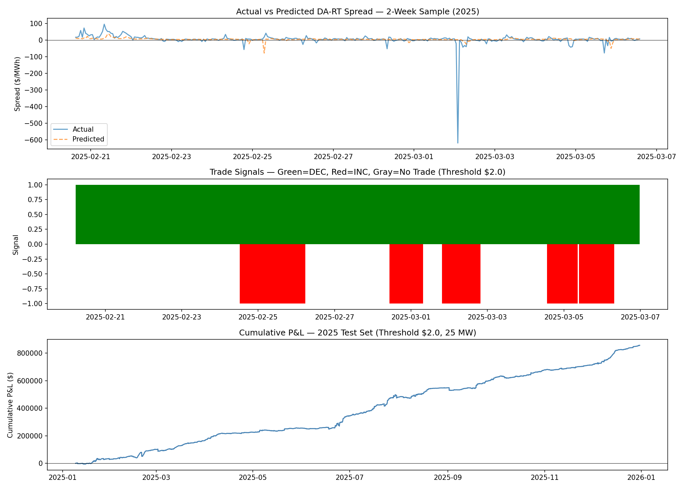
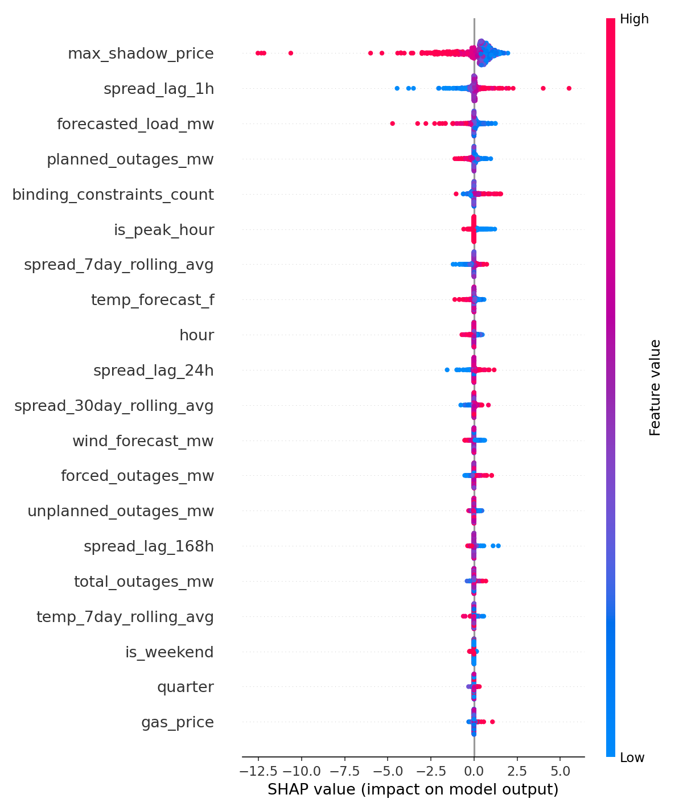

# MISO DA-RT Spread Forecasting

DA-RT spread forecasting is one of the core signals for virtual bidding in MISO. This project builds an end-to-end LSTM pipeline to forecast hourly spreads on the Michigan Hub and generate DEC/INC signals for day-ahead market participation.

---

## Why LSTM

DA-RT spreads aren't driven by any single factor. They come from the interaction between transmission congestion, weather, outages, and demand all hitting at the same time. A heat wave on its own doesn't blow out the spread; it does when the grid is already constrained. A linear model can't capture that.

I went with LSTM over gradient boosting because the spread at any given hour is heavily dependent on what's been happening over the past week. Congestion events build over days, heat waves sustain, weekly demand patterns repeat. Gradient boosting treats each hour independently unless you manually engineer every lag combination. LSTM learns those temporal dependencies from the sequence directly, which is the right fit for a 168-hour lookback window.

---

## Architecture

```
MISO Pricing API --+
MISO LGI API    --|
EIA API         --+--> SQLite DB (9 tables, 26k rows) --> Feature Engineering --> LSTM --> Signal
Manual Flat Files -+                                       (hourly_features)     (168hr)  DEC/INC/HOLD
```

- 2-layer LSTM -> Dense(128->64->1)
- 23 features x 168 hourly timesteps (1-week lookback)
- Target: DA minus RT spread ($/MWh)
- Signal threshold: +/-$2.00/MWh, 25 MW position

---

## Pipeline

### 1. Data Ingestion — Scripts 01-08

Nine tables in a local SQLite database, pulled from MISO and EIA APIs where available:

```
da_prices        hourly day-ahead LMPs          MISO Pricing API
rt_prices        hourly real-time LMPs          MISO Pricing API
load_forecast    hourly load forecasts          MISO LGI API
wind_forecast    hourly wind generation         MISO LGI API
gas_prices       Henry Hub daily prices         EIA API
weather_forecast GFS MOS forecasts              flat file
outages          forced/planned/unplanned MW    flat file
transmission     binding constraints + shadow   flat file
holidays         NERC calendar                  flat file
```

Scripts 06-08 use flat files because no public API was available for those sources.

```
26,303 rows -- 2023-01-01 to 2025-12-31
```

---

### 2. Feature Engineering — Script 09

Joins everything into an `hourly_features` table. The main issue here was GFS MOS weather forecasts. They're only issued at 00, 03, 06, 09, 12, 15, 18, 21 UTC, which left 16 out of every 24 hours null. That was 66.7% of the temperature forecast column wiped out before touching the model.

The fix is a forward-fill in SQL. Each MOS run covers a forecast trajectory for future hours, so carrying the last issued value forward until the next run is the correct approach. That's how production weather systems handle it.

```
temp_forecast_f null:  66.7% -> 0.0%  (17,537 rows fixed)
```

Final feature set covers temporal, weather/load, fuel, outages, transmission congestion, autoregressive lags (1h, 24h, 168h), and rolling averages. 23 features total.

---

### 3. Training

```
Train: 16,487 rows  2023-01-08 to 2024-12-31
Test:   8,385 rows  2025-01-01 to 2025-12-30
```

```
Input (23 features x 168 timesteps)
  └-> LSTM(hidden=128, layers=2, dropout=0.2)
        └-> Linear(128->64) -> ReLU -> Dropout(0.2) -> Linear(64->1)
```

```
Epoch  5   0.8721
Epoch 10   0.7581
Epoch 15   0.6536
Epoch 20   0.5414
Epoch 25   0.5119
Epoch 30   0.4608
```

---

### 4. Evaluation

```
MAE:                  $14.01  (baseline: $13.28)
RMSE:                 $37.97
Directional Accuracy: 59.6%

Excluding 97 extreme hours (>3 std):
  MAE:   $11.45   RMSE: $21.75   Dir: 59.5%
```

The RMSE looks bad but it's being pulled up by extreme congestion and scarcity pricing events, hours where the spread hits $200+ that no model is going to predict accurately. The number that matters for trading is directional accuracy, and that stays consistent whether or not you include the extremes.

| Quarter | Hours | MAE | Dir. Acc |
|---|---|---|---|
| Q1 | 1,942 | $13.13 | 60.5% |
| Q2 | 2,055 | $13.88 | 50.1% |
| Q3 | 2,059 | $17.43 | 58.6% |
| Q4 | 2,161 | $11.67 | 68.8% |

Q2 is basically a coin flip. Q3 has the highest MAE because of summer heat events. Q4 is the strongest quarter.

---

### 5. Backtest

DEC if predicted spread > threshold, INC if below negative threshold, no trade otherwise. P&L = signal x actual spread x 25 MW.

| Threshold | Trades | Win Rate | Total P&L | Avg $/hr |
|---|---|---|---|---|
| $0.50 | 7,457 | 60.3% | $981,461 | $131 |
| $1.00 | 6,744 | 60.9% | $983,651 | $146 |
| **$2.00** | **5,497** | **62.4%** | **$962,684** | **$175** |
| $3.00 | 4,441 | 63.1% | $927,934 | $209 |
| $5.00 | 2,966 | 63.8% | $764,793 | $258 |

$2.00 is where I landed. Going higher keeps improving win rate but total P&L starts dropping because you're sitting out too many hours. Going lower trades more but the edge gets thinner.

| Quarter | P&L | Trades |
|---|---|---|
| Q1 | $205,530 | 1,363 |
| Q2 | $160,269 | 1,373 |
| Q3 | $311,283 | 1,284 |
| Q4 | $285,604 | 1,477 |
| **Total** | **$962,684** | **5,497** |



---

### 6. Feature Importance



Transmission congestion completely dominates. `max_shadow_price` and `binding_constraints_count` are the top drivers by a wide margin. Weather and load matter but mostly through their effect on whether the grid is constrained in the first place. `gas_price`, `is_weekend`, and `is_holiday` had almost no impact, which makes sense for a spread model versus an absolute price model.

---

### 7. Inference

`inference.py` loads the saved model weights and scalers, pulls the latest 168 hours from the database, and outputs a signal. Runs in under a second. Schedule before 10am CT for DA market close. Every prediction gets logged to an `inference_log` table so there's a full record of what was predicted versus what actually happened once RT prices settle.

```
Model and scalers loaded. Running inference at 2026-03-01 09:45

--------------------------------------------------
  Target hour:       2026-03-01 10:00 CT
  Predicted spread:  $4.23/MWh  (DA - RT)
  Signal:            DEC
  Position size:     25 MW
  Expected P&L:      $106
--------------------------------------------------
  Logged to inference_log in DB.
```

---

## Setup

```bash
git clone https://github.com/yourusername/MISO_Trading_Analysis.git
cd MISO_Trading_Analysis
pip install -r requirements.txt
```

Create a `.env` file in the project root:
```
MISO_PRICING_KEY=your_key_here
MISO_LGI_KEY=your_key_here
EIA_KEY=your_key_here
```

Run ETL scripts in order:
```bash
python scripts/01_initialize_db.py
python scripts/02_fetch_da_prices.py
python scripts/03_fetch_rt_prices.py
python scripts/04_fetch_load_forecast.py
python scripts/05_fetch_wind_forecast.py
python scripts/06_load_weather_forecast.py
python scripts/07_load_gas_prices.py
python scripts/08_load_outages.py
python scripts/09_build_features.py
```

Train by opening `notebooks/lstm_spread_model.ipynb` and running all cells. Takes around 20 minutes on CPU. Saves model weights and scalers to `outputs/` on completion.

```bash
python inference.py
```

---

## Structure

```
MISO_Trading_Analysis/
├── scripts/
│   ├── 01_initialize_db.py
│   ├── 02_fetch_da_prices.py
│   ├── 03_fetch_rt_prices.py
│   ├── 04_fetch_load_forecast.py
│   ├── 05_fetch_wind_forecast.py
│   ├── 06_load_weather_forecast.py
│   ├── 07_load_gas_prices.py
│   ├── 08_load_outages.py
│   └── 09_build_features.py
├── notebooks/
│   └── lstm_spread_model.ipynb
├── outputs/
│   ├── model_performance.png
│   └── shap_summary.png
├── inference.py
├── build_features.sql
├── requirements.txt
├── .gitignore
└── README.md
```

---

2025 is one year of out-of-sample data. Enough to validate the approach, not enough to draw conclusions across all market regimes.
